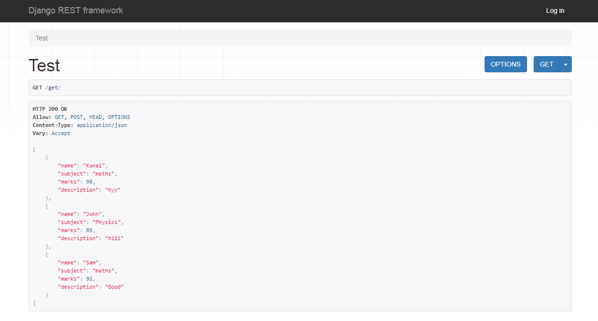
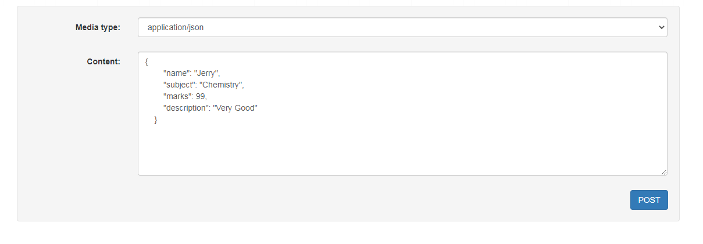

# Django-REST-API
 
Django REST framework is a powerful and flexible toolkit for building Web APIs. In this we build a REST API in Django.

Used GET and POST Request:

GET - It returns some data from the API based on the endpoint you visit.

POST - Creates a new record that gets appended to the database.

#### Visit the endpoint via GET

#### Send a POST request

